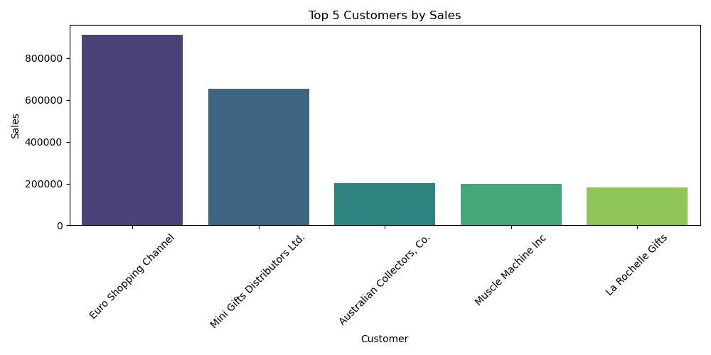
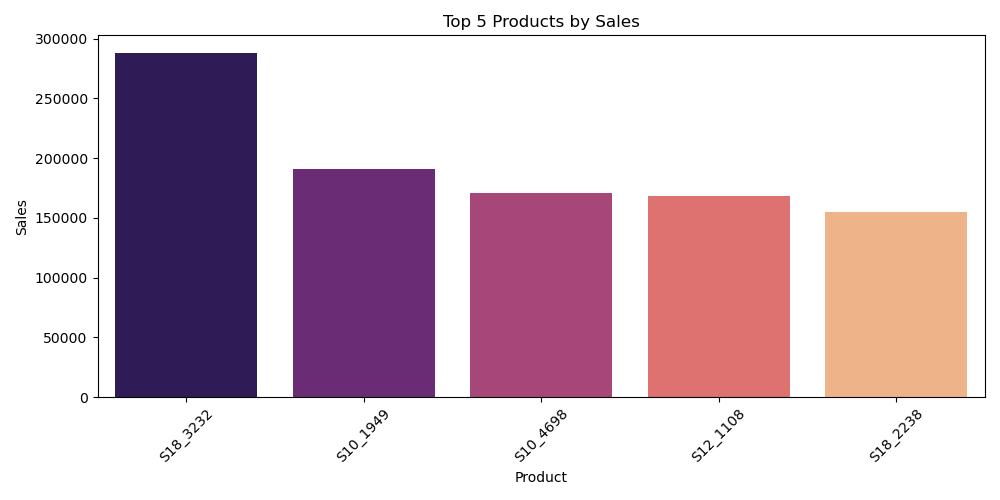
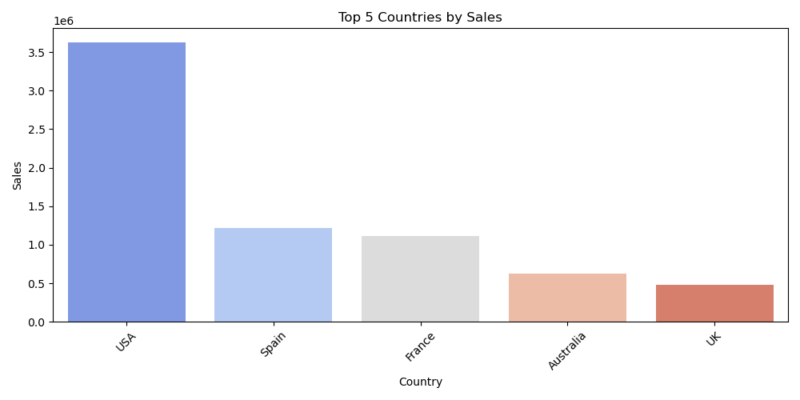
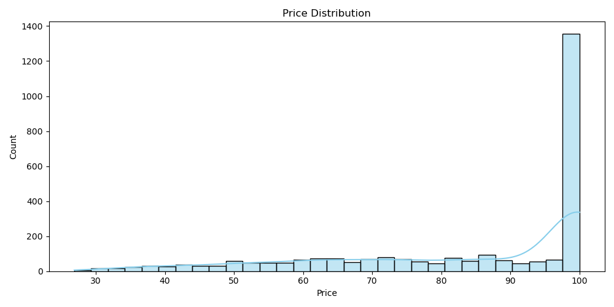

# Project Overview – Sales Analysis

## 1️⃣ Dataset Summary
- **Total Orders:** 307
- **Total Customers:** 92
- **Total Revenue:** $10,032,628.85
- **Number of Countries:** 19
- **Number of Products:** 109

## 2️⃣ Key Insights

### 🔹 Time Analysis
- Peak sales occurred in **Nov 2004**
- Sales trend shows **growth in 2004**
- Highest monthly revenue: $1,089,048.01
- Seasonal pattern: Q4 generally has higher sales

### 🔹 Customer Analysis
- Top 3 loyal customers contributed to ~17.6% of total revenue
- Number of new customers per year: {2003: 69, 2004: 84, 2005: 40}
- Top 5% of customers account for ~19.6% of total sales (Pareto principle)

### 🔹 Product Analysis
- **Most profitable product:** S18_3232
- **Highest quantity sold:** S18_3232

### 🔹 Geographic Analysis
- **Top country by sales:** USA (~36.2% of total revenue)
- Top 5 countries contribute ~70.4% of total sales

### 🔹 Price Analysis
- Price distribution (summary): mean $83.66, std $20.17, min $26.88, max $100.0
- 0 orders with price > $5,000

## 3️⃣ Recommendations

- Focus marketing efforts on low-season months.
- Increase stock for top-selling products.
- Launch loyalty programs for top 5% of customers.
- Consider geographic expansion in countries with potential growth.

## 4️⃣ Conclusion
This project provides a complete overview of sales, customer behavior, product performance, and geographic distribution.  
All analyses aim to support **data-driven business decisions** and improve revenue optimization.
